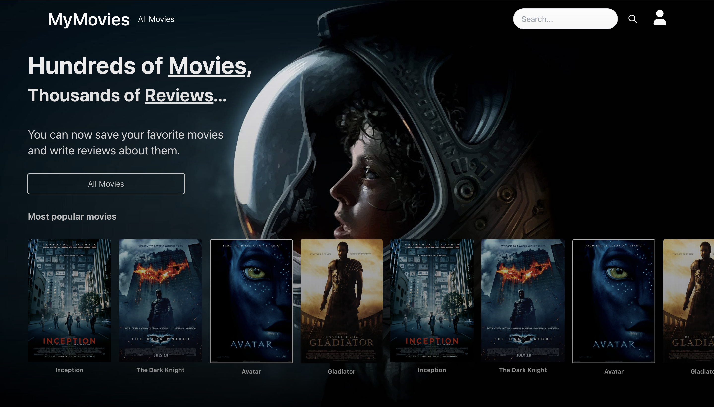

# MyMovies - Movie Review Web App

MyMovies is a web application that allows users to discover and review their favorite movies. Users can browse a vast collection of movies, save their favorites, and share their thoughts through reviews. It's the perfect platform for movie enthusiasts!



## Table of Contents

- [Demo](#demo)
- [Features](#features)
- [Getting Started](#getting-started)
  - [Prerequisites](#prerequisites)
  - [Installation](#installation)
- [Usage](#usage)
- [Contributing](#contributing)
- [License](#license)
- [Acknowledgments](#acknowledgments)

## Demo

You can try out a live demo of MyMovies at (Coming soon).

## Features

- Browse a vast collection of movies.
- Search for movies by title, genre, or director.
- Save your favorite movies to your profile.
- Write and share reviews for movies.
- User authentication and registration.
- Top-rated movies and shows lists.
- Responsive design for various devices.

## Getting Started

These instructions will help you set up a local development instance of MyMovies on your machine.

### Prerequisites

- Node.js (v14 or higher)
- npm (v6 or higher)
- Firebase account and project (for authentication)

### Installation

1. Clone the repository to your local machine:

   ```bash
   git clone https://github.com/andersstensland/mymovies.git
2. Install dependencies:
   cd mymovies
   npm install
3. Set up Firebase:
   Set up authentication and obtain API keys.
   Create a Firebase project.
   Update the Firebase configuration in the project
4. Run the development server:
   npm start


// 


Certainly! Here's the complete README for your MyMovies Movie Review Web App:

markdown
Copy code
# MyMovies - Movie Review Web App

MyMovies is a web application that allows users to discover and review their favorite movies. Users can browse a vast collection of movies, save their favorites, and share their thoughts through reviews. It's the perfect platform for movie enthusiasts!


## Table of Contents

- [Demo](#demo)
- [Features](#features)
- [Getting Started](#getting-started)
  - [Prerequisites](#prerequisites)
  - [Installation](#installation)
- [Usage](#usage)
- [Contributing](#contributing)
- [License](#license)
- [Acknowledgments](#acknowledgments)

## Demo

You can try out a live demo of MyMovies at (Coming soon).

## Features

- Browse a vast collection of movies.
- Search for movies by title, genre, or director.
- Save your favorite movies to your profile.
- Write and share reviews for movies.
- User authentication and registration.
- Top-rated movies and shows lists.
- Responsive design for various devices.

## Getting Started

These instructions will help you set up a local development instance of MyMovies on your machine.

### Prerequisites

- Node.js (v14 or higher)
- npm (v6 or higher)
- Firebase account and project (for authentication)

### Installation

1. Clone the repository to your local machine:

   ```bash
   git clone https://github.com/andersstensland/mymovies.git
Install dependencies:

bash
Copy code
cd mymovies
npm install
Set up Firebase:

Create a Firebase project.
Set up authentication and obtain API keys.
Update the Firebase configuration in the project.
Run the development server:

bash
Copy code
npm start
## Usage
Great job on setting up MyMovies! Now, let's dive into how users can make the most out of your web app.

Browsing Movies
Homepage: Upon entering the website, users are greeted with a curated selection of movies. They can scroll through this section to discover new and popular releases.

Navigation: Use the top navigation bar to explore different sections of the app. Categories like "Top Rated," "Genres," and "Directors" can help users narrow down their preferences.

Searching for Movies
Search Bar: The search bar at the top allows users to find specific movies by title, genre, or director. This is a handy tool for those looking for something particular.
Managing Favorites
User Profile: Users can create an account or log in to save their favorite movies. The profile section stores their saved movies for quick access.
Writing Reviews
Review Section: Each movie page should have a dedicated section for user reviews. Encourage users to share their thoughts, ratings, and recommendations.
Contributing
Your project is open for contributions, which is fantastic! Encourage developers to contribute to the project by following the guidelines outlined in the "Contributing" section of the README.

Contributing
Fork the Repository: Developers should start by forking the main repository to their GitHub account.

Clone Locally: After forking, they can clone the repository to their local machine.

Create a Branch: Developers should create a new branch for their contribution. This keeps the main branch clean and allows for easy collaboration.

Make Changes: Time to code! Developers can make the necessary changes or additions to the project.

Test Locally: Before submitting a pull request, it's essential to test the changes locally to ensure everything works as expected.

Submit Pull Request: Once satisfied with the changes, developers can submit a pull request. Encourage them to provide a detailed description of their contribution.

License
Include information about the license under which MyMovies is distributed.

Acknowledgments
If there are any individuals or resources that you'd like to acknowledge, this is the section to do so.

This README provides a comprehensive guide for users and contributors, helping them navigate and understand MyMovies better. Great work!
